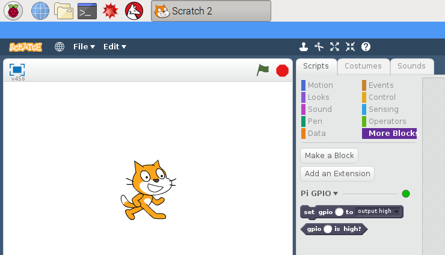
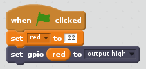
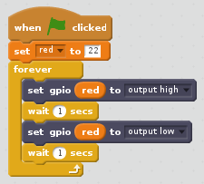
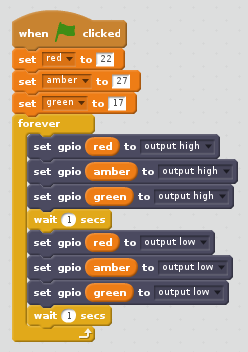

# Traffic lights with Scratch 2

## Connect the LEDs

1. Connect your LEDs to the following pins:

| LED       | GPIO  |
| --------- | :------: |
| Red       | 22       |
| Amber     | 27       |
| Green     | 17       |

## Control the LEDs

1. Open **Scratch 2** from the Programming menu (**Scratch 2**, not **Scratch**).

1. Open the **More Blocks** panel, click **Add an Extension**, and select **Pi GPIO**. You should then see two new blocks appear:

    

1. Open the **Events** panel and drag in a **when flag clicked** block.

1. Open the **Data** panel and click **Make a Variable**. Enter the variable name **red**, drag a **set red to 0** in, dock it under the previous block and set the value to **22**.

1. Open the **More Blocks** panel and drag in a **set gpio to output high** block and dock it under the previous block.

1. Return to the **Data** panel and drag in a **red** variable block and place it inside the **set gpio** block. Your code should now look like this:

    

1. Now click the green flag to run your code. You should see the red LED light up.

1. Now add a **wait 1 secs** block before and after turning the LED off with **set gpio red to output low**, and wrap it in a **forever** block to blink continuously:

    

1. Click the green flag again and you should see the LED blink.

1. Now add some more **set gpio** and **wait** blocks to introduce the other two lights, and make them all flash on and off:

    

1. Click the green flag again and you should see the three lights flash together.

1. Can you change the number in **wait 1 secs** to speed up or slow down the sequence?

## Traffic lights sequence

1. Try turning the lights on and off in sequence:

1. Now you know how to control the lights individually, and time the pauses between commands, can you create a traffic lights sequence? The sequence goes:

    - Green on
    - Amber on
    - Red on
    - Red and amber on
    - Green on

It's important to think about timing. How long should the lights stay on for at each stage?

Once you have completed the traffic light sequence, you might want to try adding in a button and a buzzer to make an interactive traffic light for a pedestrian crossing.
